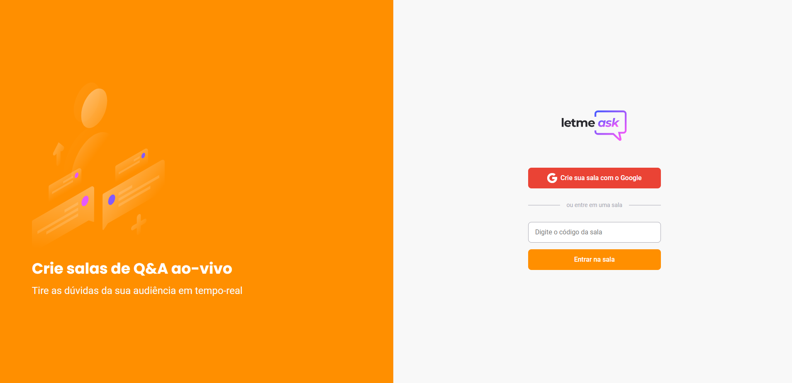
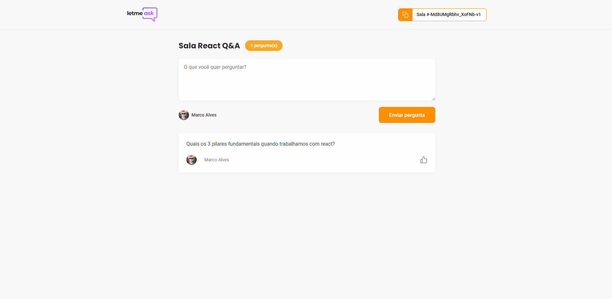

<!-- PROJECT LOGO -->
<br />
<p align="center">
  <a href="https://letmeask-93589.web.app/">
    
  </a>

  <h3 align="center">Let me ask - NLW 06</h3>
</p>


<!-- TABLE OF CONTENTS -->
<details open="open">
  <summary>Sumário</summary>
  <ol>
    <li>
      <a href="#getting-started">Começando</a>
      <ul>
        <li><a href="#prerequisites">Pré Requisitos</a></li>
        <li><a href="#installation">Instalação</a></li>
				<li><a href="#tests">Testes Unitários</a></li>
      </ul>
    </li>
  </ol>
</details>


<!-- GETTING STARTED -->
## Getting Started
Esse projeto foi realizado utilizando: ReactJS, React Hooks, TypeScript, Yarn, Sass, Firebase Realtime Database, Firebase Hosting, Firebase Auth e React Toastify.

Para usar a aplicação basta acessar o endereço abaixo, você pode criar ou entrar em salas já existentes.

Link do projeto: https://letmeask-93589.web.app/

### Prerequisites

Para instalar o projeto na sua máquina é necessário ter o Node instalado. Também é necessário instalar o Yarn:
* npm
  ```sh
  npm install --global yarn
  ```

### Installation

1. Clone o repositório
	```sh
	git clone https://github.com/marcoalvesalmeida/let-me-ask.git
	```
2. Instale os pacotes necessário na pasta do projeto usando:
	```sh
	yarn
	```
3. O firebase é configurado no arquivo `.env` (Use o .env.example como base)
   ```JS
    REACT_APP_API_KEY="REACT_APP_API_KEY"
    REACT_APP_AUTH_DOMAIN="REACT_APP_AUTH_DOMAIN"
    REACT_APP_DATABASE_URL="REACT_APP_DATABASE_URL"
    REACT_APP_PROJECT_ID="REACT_APP_PROJECT_ID"
    REACT_APP_STORAGE_BUCKET="REACT_APP_STORAGE_BUCKET"
    REACT_APP_MESSAGING_SENDER_ID="REACT_APP_MESSAGING_SENDER_ID"
    REACT_APP_APP_ID="REACT_APP_APP_ID"
   ```
4. Para executar o projeto basta utilizar o comando:
   ```sh
   yarn start
   ```
5. Acesse localmente em: http://localhost:3000

<p align="center">
  <a href="https://letmeask-93589.web.app/">
    
  </a>
	<a href="https://letmeask-93589.web.app/">
		
	</a>
</p>


